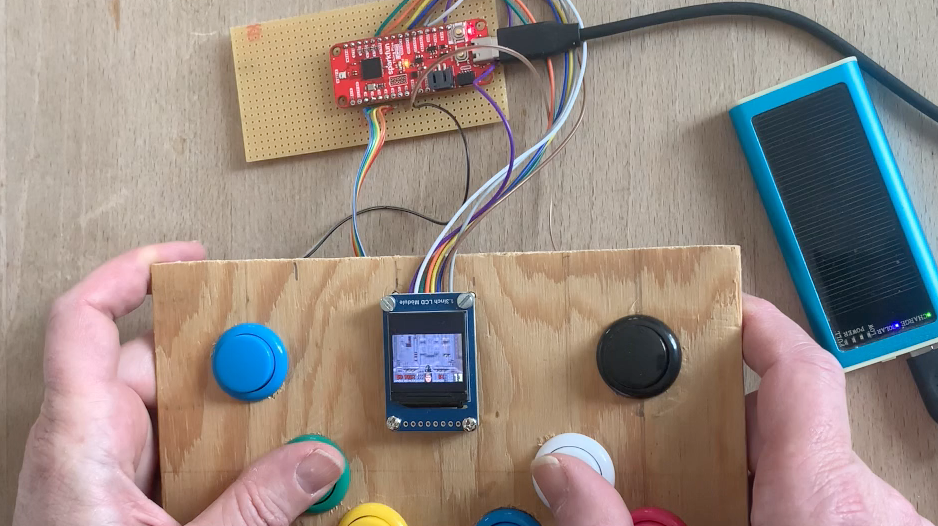

# PicoDoom, a fork of GBA Doom



## Hardware

- [Sparkfun Thinkplus - rp2040](https://www.sparkfun.com/products/17745) Raspberry Pico Board has too little Flash
- [ST7789 OLED Display](https://www.waveshare.com/product/displays/lcd-oled/lcd-oled-3/1.3inch-lcd-module.htm) Any ST7789 240x240 Display should work
- 10 Buttons

## Wiring

ST7789 <-> SparkFun
- VCC to 3.3V
- GND to GND
- DIN to 4/COPI (Computer Out Peripheral In)
- CLK to 5/SCK
- CS to 29/ADC3 (not needed if ST778 doesn't have a CS)
- DC to 28/ADC2
- RST to 27/ADC1
- BL to 26/ADC0

Buttons are arranged as a matrix of 2 rows AND 5 colums
- Row 0-1 to Pin 16 - 17
- Columns 0 - 4 to Pin 18 - Pin 22 

Debug Output as Serial on USB

## Building

Requirements [Pico SDK](https://www.raspberrypi.com/documentation/microcontrollers/c_sdk.html)

```
git clone https://github.com/oflebbe/GBADoom
cd GBADoom
mkdir build
cd build
cmake -GNinja  ..
ninja
```

## Acknowledgements
- [GBADoom Team](https://github.com/doomhack/GBADoom)
- Ivan Belokobylskiy for the fast [st7789_mpy Driver](https://github.com/devbis/st7789_mpy)


## GBADoom

A port of prBoom to the GBA.

**What's hot?**

- Supports Doom Shareware, Retail, Ultimate and Doom2 IWADS.

- Renderer is largely intact. Z-Depth lighting is gone and there is mip-mapping but it's otherwise complete.

- Monster behaviour is all intact. (I.e sound propagation etc.)

- Framerate is pretty variable. Simple areas run at ~35fps. Complex areas (Eg: E4M2) chug along at about 10 FPS. It's running around the same as the original GBA Doom1 and Doom2 ports. Doom1 Episodes 1-3 are all completely playable. Episode 4 chugs.

- Sound and music support. Big thanks to BloodShedder for his Chiptune Doom MOD files.

**What's not?**

- My Markdown skills.

- Demo compatibility is broken.

- General optimisation. We're never going to get a perfect 35FPS but I think there is still another 25% left without changing the visual quality/correctness/game behaviour. For reference, the first time I ran a build under the emulator it ran at about 3FPS.

- Although it is based on prBoom, most of the engine enhancements (dehacked, limit removing etc) have been reverted back to Vanilla. This is either for memory or performance reasons. Sadly, NUTS.wad and Okuplok are right out!

- No multiplayer. 


KippyKip is maintaining an upstream fork with new features and fixes. [KippyKip GBA fork](https://github.com/Kippykip/GBADoom)


## Cheats:
**Chainsaw:** L, UP, UP, LEFT, L, SELECT, SELECT, UP  
**God mode:** UP, UP, DOWN, DOWN, LEFT, LEFT, RIGHT, RIGHT  
**Ammo & Keys:** L, LEFT, R, RIGHT, SELECT,UP, SELECT, UP  
**Ammo:** R, R, SELECT,R, SELECT,UP, UP, LEFT  
**No Clipping:** UP, DOWN, LEFT, RIGHT, UP, DOWN, LEFT, RIGHT  
**Invincibility:** A, B, L, R, L, R, SELECT, SELECT  
**Berserk:** B, B, R, UP, A, A, R, B  
**Invisibility:** A, A, SELECT,B, A, SELECT, L, B  
**Auto-map:** L, SELECT,R, B, A, R, L, UP  
**Lite-Amp Goggles:** DOWN,LEFT, R, LEFT, R, L, L, SELECT  
**Exit Level:** LEFT,R, LEFT, L, B, LEFT, RIGHT, A  
**Enemy Rockets (Goldeneye):** A, B, L, R, R, L, B, A  
**Toggle FPS counter:** A, B, L, UP, DOWN, B, LEFT, LEFT  

## Controls:  
**Fire:** B  
**Use / Sprint:** A  
**Walk:** D-Pad  
**Strafe:** L & R  
**Automap:** SELECT  
**Weapon up:** A + R  
**Weapon down:** A + L  
**Menu:** Start  

## Building:

To build the GBA version, you will need DevKitArm. The easiest way to get up and running for Windows users is download the installer from here (https://github.com/devkitPro/installer/releases) and install the GBA dev components.

You will also need to use GBAWadUtil, included in the "GBAWadUtil\" directory. Alternatively download the latest build from the main source: (https://github.com/doomhack/GbaWadUtil). Windows (x64) users can download the Binary release from the releases page.

1) Download or Clone GBADoom source code.
Extract the contents to a folder: (Eg: C:\DevKitPro\Projects\GBADoom)

2) Use GBAWadUtil to create a header file with the WAD data. Retail, Ultimate and Doom2 wads have been tested. Plutonia and TNT should mostly work. 
Open a command prompt.
Type the following:
**GbaWadUtil.exe -in doom.wad -cfile doom.wad.c**
And copy it to the **source\\iwad\\** directory.
Alternatively just run the **build_XXXX.bat** files and it'll create it in the source\iwad\ path.

3) Open C:\DevKitPro\Projects\GBADoom\source\doom_iwad.h in text editor or code editor of your choice.
4) Change the first line to #include "iwad/**yourfile**.c" e.g.
#include "iwad/doom1.c"
#include "iwad/doom.c"
#include "iwad/doom2.c"
#include "iwad/tnt.c"
#include "iwad/plutonia.c"

5) Run msys2.bat and type **make**
You may need to edit the msys2.bat with notepad and change the path to go to your real "**msys2\msys2_shell.bat**" file within it if it doesn't work.

6) The project should build GBADoom.gba and GBADoom.elf. It will take about 5 minutes or so. You may see a lot of warning messages on the screen. These are normal.

7) Copy GBADoom.gba (this is the rom file) to your flash cart or run in a emulator.


## Developers:

For development, this project also builds for Windows with Qt. Use the MingW 32bit version or MSVC 32bit. The .pro file at the root of the source tree can be opened in Qt Creator.
